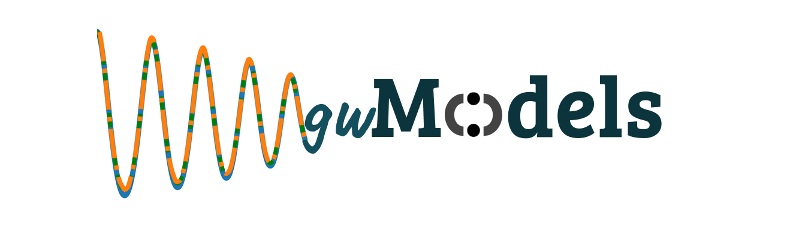

[](https://arxiv.org/abs/2403.15506)
[](https://arxiv.org/abs/2403.03487)
[](https://arxiv.org/abs/2408.02762)
[](https://arxiv.org/abs/2502.02739)
[](https://arxiv.org/abs/2604.17868)
[](https://arxiv.org/abs/2511.11536)


[](https://github.com/tousifislam/gwModels/blob/main/LICENSE)


## **gwModels**
This package is intended to host a variety of data-driven and phenomenological models for the gravitational radiation (waveforms) emitted from binary black hole mergers. For questions, suggestions or collaborations, please feel free to drop an email to tousifislam24@gmail.com. Detailed documentation of the package is provided at http://tousifislam.com/gwModels/gwModels.html

## Getting the package
The latest development version will always be available from the project git repository:
```bash
git clone https://github.com/tousifislam/gwModels
cd gwModels
pip install -e .
```

### Data files
Model data files are stored in the `data/` directory. After cloning, verify all data files are present:
```bash
python gwmodels_setup_data.py
```

## Available Models

### 1. Waveform Frameworks

#### 1a. gwNRHME
A framework to seamlessly convert a multi-modal (i.e with several spherical harmonic modes) non-spinning quasi-circular waveform into multi-modal eccentric waveform if the quadrupolar eccentric waveform is known ([arXiv:2403.15506](https://arxiv.org/abs/2403.15506)).

Tutorial: [1_1_framework_gwNRHME_example.ipynb](tutorials/1_1_framework_gwNRHME_example.ipynb)

#### 1b. gwNRXHME
A framework to seamlessly convert a multi-modal (i.e with several spherical harmonic modes) non-precessing quasi-circular waveform into multi-modal eccentric waveform if the quadrupolar eccentric waveform is known ([arXiv:2403.15506](https://arxiv.org/abs/2403.15506)).

### 2. Higher modes model with eccentricity
These variants are obtained by combining circular and eccentric models through gwNRHME:
- **NRHybSur3dq8-gwNRHME** = NRHybSur3dq8 ([arXiv:1812.07865](https://arxiv.org/abs/1812.07865)) + SEOBNRv5EHM
- **BHPTNRSur1dq1e4-gwNRHME** = BHPTNRSur1dq1e4 ([arXiv:2204.01972](https://arxiv.org/abs/2204.01972)) + SEOBNRv5EHM

Tutorials: [2_1_NRHybSur3dq8-gwNRHME_example.ipynb](tutorials/2_1_NRHybSur3dq8-gwNRHME_example.ipynb), [2_2_BHPTNRSur1dq1e4-gwNRHME_example.ipynb](tutorials/2_2_BHPTNRSur1dq1e4-gwNRHME_example.ipynb)

### 3. Eccentricity estimation
Calculates $e_{\xi}$, $e_{\omega}$ and $e_{\rm gw}$ following Islam and Venumadhav ([arXiv:2502.02739](https://arxiv.org/abs/2502.02739)).

Tutorial: [3_1_eccentricity_estimation_nonprecessing.ipynb](tutorials/3_1_eccentricity_estimation_nonprecessing.ipynb)

### 4. Dynamics: eccentricity evolution models

#### 4a. gwEccEvNS
A fast approximate eccentricity evolution model for non-spinning binaries based on SXS NR simulations from Islam and Venumadhav ([arXiv:2502.02739](https://arxiv.org/abs/2502.02739)).

Tutorial: [4_1_dynamics_gwEccEvNS.ipynb](tutorials/4_1_dynamics_gwEccEvNS.ipynb)

#### 4b. gwEccEvNSv2
Analytical eccentricity evolution model for non-spinning binaries from Islam et al. ([arXiv:2604.17868](https://arxiv.org/abs/2604.17868)).

Tutorial: [4_2_dynamics_gwEccEvNSv2.ipynb](tutorials/4_2_dynamics_gwEccEvNSv2.ipynb)

#### 4c. gwEccEvolve_NoSpinq4
SVD-based surrogate model for eccentricity evolution in non-spinning BBH systems ($1 \leq q \leq 4$, $0.003 \leq e_0 \leq 0.443$) from Islam et al. ([arXiv:2604.17868](https://arxiv.org/abs/2604.17868)). Uses Gaussian Process Regression for SVD coefficient prediction (pure numpy/scipy, no scikit-learn dependency).

Tutorial: [4_3_dynamics_gwEccEvolve_NoSpinq4.ipynb](tutorials/4_3_dynamics_gwEccEvolve_NoSpinq4.ipynb)

### 5. Remnant models: final mass, spin, and kick

#### 5a. gwModel_kick_q200 (aligned-spin kick)
Analytical aligned-spin kick velocity model trained on NR (SXS + RIT, $q \leq 32$) and BHPT data ($q \leq 200$), valid for $1 \leq q \leq 1000$, from Islam and Wadekar ([arXiv:2511.11536](https://arxiv.org/abs/2511.11536)).

#### 5b. gwModel_kick_q200_GPR (aligned-spin GPR kick)
GPR-based aligned-spin kick model trained on the same dataset, providing both analytical and GPR predictions with uncertainty. Requires `scikit-learn`. From Islam and Wadekar ([arXiv:2511.11536](https://arxiv.org/abs/2511.11536)).

#### 5c. gwModel_kick_prec_flow (precessing kick)
Normalizing-flow model for precessing-spin kick velocity distributions. Given $(q, a_1, a_2)$, marginalizes over spin angles and returns samples from the kick distribution. Requires `torch` and `nflows`. From Islam and Wadekar ([arXiv:2511.11536](https://arxiv.org/abs/2511.11536)).

#### 5d. HLZ precessing kick
Precessing kick velocity from Gonzalez et al. (2007), Campanelli et al. (2007), Lousto & Zlochower (2008, 2013). Includes aligned-spin variant from [arXiv:1406.7295](https://arxiv.org/abs/1406.7295).

#### 5e. HBR final mass and spin
Final mass from Barausse, Morozova & Rezzolla (2012) and final spin from Hofmann, Barausse & Rezzolla (2016).

#### 5f. UIB2016 final mass and spin
Aligned-spin final mass and spin from Jimenez Forteza, Keitel, Husa et al. ([arXiv:1611.00332](https://arxiv.org/abs/1611.00332)).

Tutorials: [5_1_gwModels_kicks.ipynb](tutorials/5_1_gwModels_kicks.ipynb), [5_2_other_remnant_models.ipynb](tutorials/5_2_other_remnant_models.ipynb)

## Requirements
This package requires Python 3 and gwtools.

```bash
pip install gwtools
```

Optional dependencies for specific models:
- `scikit-learn` — for `gwModel_kick_q200_GPR`
- `torch`, `nflows` — for `gwModel_kick_prec_flow`
- `gwsurrogate` — for NRHybSur3dq8-gwNRHME and BHPTNRSur1dq1e4-gwNRHME tutorials

## Issue tracker
Known bugs are recorded in the project bug tracker:
https://github.com/tousifislam/gwModels/issues

## License
This code is distributed under the MIT License. Details can be found in the LICENSE file.

## Maintainer
Tousif Islam

## Citation guideline
If you make use of the gwModels framework, please cite the relevant papers:

```
@article{Islam:2024rhm,
    author = "Islam, Tousif",
    title = "{Straightforward mode hierarchy in eccentric binary black hole mergers and associated waveform model}",
    eprint = "2403.15506",
    archivePrefix = "arXiv",
    primaryClass = "astro-ph.HE",
    month = "3",
    year = "2024"
}
```

```
@article{Islam:2024tcs,
    author = "Islam, Tousif",
    title = "{Study of eccentric binary black hole mergers using numerical relativity and an inspiral-merger-ringdown model}",
    eprint = "2403.03487",
    archivePrefix = "arXiv",
    primaryClass = "gr-qc",
    month = "3",
    year = "2024"
}
```

```
@article{Islam:2024zqo,
    author = "Islam, Tousif and Khanna, Gaurav and Field, Scott E.",
    title = "{Adding higher-order spherical harmonics in non-spinning eccentric binary black hole merger waveform models}",
    eprint = "2408.02762",
    archivePrefix = "arXiv",
    primaryClass = "gr-qc",
    month = "8",
    year = "2024"
}
```

```
@article{Islam:2025oiv,
    author = "Islam, Tousif and Venumadhav, Tejaswi",
    title = "{Post-Newtonian theory-inspired framework for characterizing eccentricity in gravitational waveforms}",
    eprint = "2502.02739",
    archivePrefix = "arXiv",
    primaryClass = "gr-qc",
    month = "2",
    year = "2025"
}
```

```
@article{Islam:2025ecc,
    author = "Islam, Tousif and others",
    title = "{Eccentricity evolution models for non-spinning binary black holes}",
    eprint = "2604.17868",
    archivePrefix = "arXiv",
    primaryClass = "gr-qc",
    month = "4",
    year = "2025"
}
```

```
@article{Islam:2025kick,
    author = "Islam, Tousif and Wadekar, Digvijay",
    title = "{Kick velocity models for binary black hole mergers}",
    eprint = "2511.11536",
    archivePrefix = "arXiv",
    primaryClass = "gr-qc",
    month = "11",
    year = "2025"
}
```
