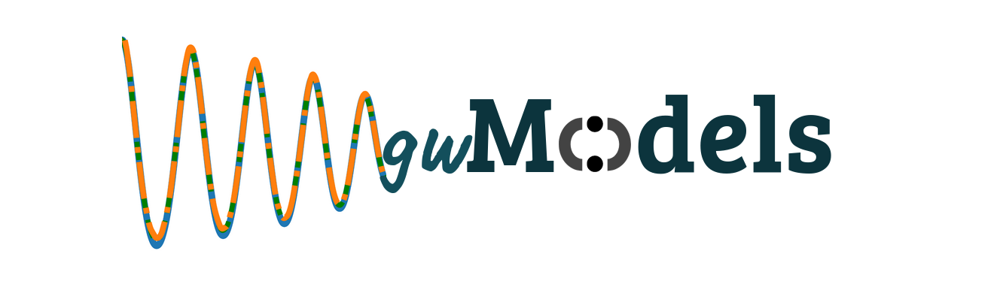

# gwModels!



**gwModels** is a Python-based package for data-driven and phenomenological models for gravitational waveforms radiated from the merger of binary black holes. For questions, suggestions or collaborations, please feel free to drop an email to tousifislam24@gmail.com. 

### Getting the package
The latest development version will always be available from the project git repository:
```bash
git clone https://github.com/tousifislam/gwModels
```

### Available Models

Currently we provde one framework and three eccentric waveform models through **gwModels**. In near future more models will be added.
#### 1. gwNRHME framework
A framework to seamlessly convert a multi-modal (i.e with several spherical harmonic modes) quasi-circular waveform into multi-modal eccentric waveform if the quadrupolar eccentric waveform is known (https://arxiv.org/abs/2403.15506).

#### 2. EccentricIMR 
Python wrapper for the PN based quadrupolar eccentric waveform model (https://arxiv.org/abs/0806.1037). Example use is here: https://github.com/tousifislam/gwModels/blob/main/tutorials/EccentricIMR_example.ipynb

#### 3. Higher modes model with eccentricity
It has two variants based on the constituent circular model. These variants are obtained by combining the following circular and eccentric model through gwNRHME.
- NRHybSur3dq8-gwNRHME = NRHybSur3dq8 (https://arxiv.org/abs/1812.07865) + EccentricIMR (https://arxiv.org/abs/0806.1037)
- BHPTNRSur1dq1e4-gwNRHME = BHPTNRSur1dq1e4 (https://arxiv.org/abs/2204.01972) + EccentricIMR (https://arxiv.org/abs/0806.1037)

Example use is here: https://github.com/tousifislam/gwModels/blob/main/tutorials/

### Requirements
This package requires Python 3, and gwtools.

```bash
pip install gwtools
```

Parts of the accompanying Jupyter notebook will require gwsurrogate, which can be installed with either pip

```bash
pip install gwsurrogate
```

or conda

```bash
conda install -c conda-forge gwsurrogate
```

### Issue tracker
Known bugs are recorded in the project bug tracker: https://github.com/tousifislam/gwModels/issues

### License
This code is distributed under the MIT License. Details can be found in the LICENSE file.

```
Copyright (c) 2024 Tousif Islam

Permission is hereby granted, free of charge, to any person obtaining a copy
of this software and associated documentation files (the "Software"), to deal
in the Software without restriction, including without limitation the rights
to use, copy, modify, merge, publish, distribute, sublicense, and/or sell
copies of the Software, and to permit persons to whom the Software is
furnished to do so, subject to the following conditions:

The above copyright notice and this permission notice shall be included in all
copies or substantial portions of the Software.

THE SOFTWARE IS PROVIDED "AS IS", WITHOUT WARRANTY OF ANY KIND, EXPRESS OR
IMPLIED, INCLUDING BUT NOT LIMITED TO THE WARRANTIES OF MERCHANTABILITY,
FITNESS FOR A PARTICULAR PURPOSE AND NONINFRINGEMENT. IN NO EVENT SHALL THE
AUTHORS OR COPYRIGHT HOLDERS BE LIABLE FOR ANY CLAIM, DAMAGES OR OTHER
LIABILITY, WHETHER IN AN ACTION OF CONTRACT, TORT OR OTHERWISE, ARISING FROM,
OUT OF OR IN CONNECTION WITH THE SOFTWARE OR THE USE OR OTHER DEALINGS IN THE
SOFTWARE.

```

### Maintainer
Tousif Islam

### Citation guideline
If you make use of the gwModels framework, please cite the following papers:

```
@article{Islam:2024rhm,
    author = "Islam, Tousif",
    title = "{Straightforward mode hierarchy in eccentric binary black hole mergers and associated waveform model}",
    eprint = "2403.15506",
    archivePrefix = "arXiv",
    primaryClass = "astro-ph.HE",
    month = "3",
    year = "2024"
}
```

```
@article{Islam:2024tcs,
    author = "Islam, Tousif",
    title = "{Study of eccentric binary black hole mergers using numerical relativity and an inspiral-merger-ringdown model}",
    eprint = "2403.03487",
    archivePrefix = "arXiv",
    primaryClass = "gr-qc",
    month = "3",
    year = "2024"
}

```
